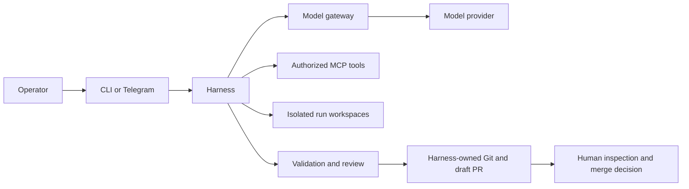

```text
      ███████╗ █████╗ ███████╗███████╗██████╗ ██╗      █████╗ ███╗   ██╗███████╗
      ██╔════╝██╔══██╗██╔════╝██╔════╝██╔══██╗██║     ██╔══██╗████╗  ██║██╔════╝
      ███████╗███████║█████╗  █████╗  ██████╔╝██║     ███████║██╔██╗ ██║█████╗
      ╚════██║██╔══██║██╔══╝  ██╔══╝  ██╔═══╝ ██║     ██╔══██║██║╚██╗██║██╔══╝
      ███████║██║  ██║██║     ███████╗██║     ███████╗██║  ██║██║ ╚████║███████╗
      ╚══════╝╚═╝  ╚═╝╚═╝     ╚══════╝╚═╝     ╚══════╝╚═╝  ╚═╝╚═╝  ╚═══╝╚══════╝

          The local-first control plane for bounded AI-agent workflows

  deterministic workflows · isolated runs · validated changes · human approval
```

Safeplane is a local-first control plane for bounded AI-agent workflows. Thin
CLI and Telegram connectors translate operator intent, while a deterministic
harness owns workflow order, run state, permissions, credentials, validation,
repository changes, Git operations, evidence, and remote-write policy.

**Status:** Safeplane is deployed and running on both a MacBook and a VPS,
including assistant and developer workflows. Public-facing documentation is
still being tightened, and the deployment packaging, recovery drills, and
operational evidence are continuing to improve.



Planned and deferred work is tracked in [Backlog](docs/BACKLOG.md).

## Architecture highlights

- **Thin connectors, explicit workflows.** CLI and Telegram select registry-backed
  entrypoints; connectors do not decide stage order, permissions, or policy.
- **Harness-owned authority.** The harness owns run and session lifecycle,
  retries, terminal states, MCP authorization, authoritative writes, checks,
  credentials, Git operations, draft-PR creation, evidence, and cleanup.
- **Validated contracts.** Pydantic schemas validate workflow inputs, model
  outputs, tool calls, and persisted artifacts. Workflows and prompts are
  versioned contracts.
- **Isolated model and tool access.** Provider access is confined to the model
  gateway. MCP calls are brokered by the harness and limited per agent.
- **Hardened runtime boundaries.** Services run non-root with read-only root
  filesystems, dropped capabilities, scoped mounts, file secrets, health checks,
  resource limits, and explicit networks.
- **Controlled repository changes.** Each developer run uses isolated
  repositories. Agents propose exact replacements; the harness validates the
  plan and budgets, generates the authoritative patch, runs controlled checks,
  and applies only an accepted candidate.
- **Independent review and evidence.** Review returns both a verdict and explicit
  plan alignment. Runs retain inspectable artifacts and evidence bundles.
- **Human merge control.** Git credentials remain harness-only. Profiles may opt
  into automatic **draft** PR creation after every binding passes; other profiles
  require explicit approval. Safeplane never merges.
- **Guarded real-world integrations.** Real OpenRouter, Telegram, GitHub, and
  external-repository validations run only through explicitly enabled,
  approval-gated paths with isolated credentials and tightly bounded permissions.
  Routine validation remains secret-free and cannot accidentally trigger these
  integrations.

## Five-minute fake-mode quickstart

Requirements: Docker Engine, the Docker Compose plugin, Python 3.11+, and
`make`.

```bash
python3 -m pip install -r requirements-dev.txt
make setup
make up
./scripts/safeplane chat "Reply with a short confirmation."
./scripts/safeplane assistant "List my calendar entries for today."
./scripts/safeplane workflows
```

The harness is published only on `127.0.0.1:8787`. Runtime state is stored under
`${SAFEPLANE_HOME:-$HOME/.safeplane}` and credentials are stored separately
under `${SAFEPLANE_SECRET_ROOT:-$HOME/.config/safeplane/secrets}`.

Stop the stack:

```bash
make down
```

## Neutral developer-workflow example

The repository includes a secret-free, local-Git fixture that exercises the
complete single-pass developer workflow with fake model responses:

```bash
tests/scripts/accept-developer-workflow
```

For an operator-owned repository, create
`${SAFEPLANE_HOME:-$HOME/.safeplane}/config/repositories.yaml` from
`config/repositories.example.yaml`, enable a profile, start the developer
Compose overlay, and run:

```bash
./scripts/safeplane develop --repo <profile> "Implement one bounded change"
```

The run either stops with evidence or becomes eligible for the profile's
configured draft-PR path. It does not loop automatically after
`REQUEST_CHANGES`, and it never merges.

## Inspect status and evidence

```bash
./scripts/safeplane runs
./scripts/safeplane status <run-id>
./scripts/safeplane evidence <run-id>
./scripts/safeplane maintenance storage
```

Evidence bundles include the run record and available pipeline, approval, and
trace artifacts. Sanitized case-study generation is separate from complete
local evidence.

## Runtime modes

| Mode | Model access | Connector or remote access | Secrets | Host exposure |
| --- | --- | --- | --- | --- |
| Fake local | fake model gateway | CLI | none | harness on loopback only |
| Local real provider | OpenRouter through model-gateway | CLI | OpenRouter file secret in model-gateway only | harness on loopback only |
| Telegram fake | fake model gateway | real Telegram long polling | Telegram file secrets in telegram-connector only | no application port required |
| Telegram real | OpenRouter plus Telegram | real Telegram long polling | provider and Telegram secrets remain service-scoped | no application port required |
| GitHub publication | fake or real model | Git and GitHub from the harness | GitHub file secret in harness only | no additional application port |
| VPS deployment | deployed private single-operator environment | assistant and developer workflows can run there | must preserve the same boundaries | no Safeplane application port planned |

See [Operations](docs/OPERATIONS.md) for exact wrappers and guarded real-mode
commands.

## Known limitations

- The deployment is live on a MacBook and a VPS, but packaging,
  reproducibility, backup or restore coverage, and recovery drills still need
  stronger operational evidence.
- Safeplane is currently a single-operator, single-instance system.
- The developer workflow is single-pass; `REQUEST_CHANGES` requires a new
  operator-started run.
- Safeplane creates at most a draft pull request and never merges, releases, or
  deploys a target repository.
- A complete runtime backup-and-restore package is not implemented yet. Current
  backup support is limited to calendar-store safety operations and preserved
  runtime directories.
- There is no natural-language workflow router, web UI, multi-user isolation,
  browser automation, Kubernetes deployment, autoscaling, or high availability.
  Currently workflows have to be selected with slash commands.

## Documentation

- [Architecture](docs/ARCHITECTURE.md)
- [Operations and runtime modes](docs/OPERATIONS.md)
- [Operator facing API](docs/API_SURFACE.md)
- [Repo content map](docs/REPO_MAP.md)
- [Container interactions and security boundaries](docs/security/runtime-boundaries.md)
- [Developer workflow and artifact flow](docs/developer-pipeline.md)
- [Local secrets](docs/security/secrets.md)
- [Telegram connector](docs/connectors/telegram.md)
- [Repository profiles and workspaces](docs/repository-workspaces.md)
- [Remote write and draft-PR policy](docs/remote-write.md)
- [Runtime artifacts and cleanup](docs/runtime-artifacts.md)
- [Calendar](docs/calendar.md)
- [Backlog](docs/BACKLOG.md)
