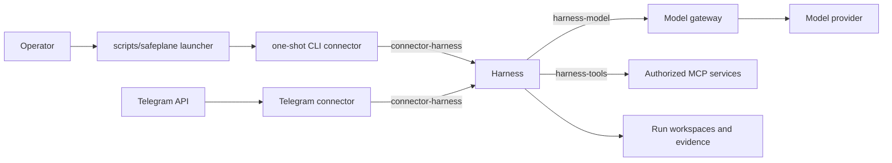

# Safeplane architecture

Safeplane is a local-first control plane for bounded AI-agent workflows. The
runtime separates operator transport from authority: connectors translate input
and presentation, while the harness owns workflow execution, state, policy,
credentials, validation, repository changes, Git operations, approvals, and
evidence.

## Current runtime topology

The CLI connector is a profiled one-shot Compose service. Each networked CLI
command creates a short-lived container, sends one request to the harness over
the internal `connector-harness` network, renders the response, and exits with a
stable status code. The host launcher contains no harness URL, request payload,
or response parsing logic.

Local-only operator utilities such as evidence collection, calendar
administration, and storage cleanup remain host-side utilities because they are
not connector-to-harness operations yet.

## Connector boundary

`connectors/common` provides the shared typed HTTP client used by the CLI. It
separates workflow ingress methods from operator-control methods in code even
though the current harness still exposes the pre-versioned HTTP paths.

`connectors/cli` owns:

- argument parsing and local validation;
- connector/control client invocation;
- human-readable terminal rendering;
- stable JSON output;
- exit-code mapping.

It does not receive runtime-state mounts, provider credentials, Telegram
credentials, GitHub credentials, target repositories, or the Docker socket. Its
only Compose network is `connector-harness`.

Telegram remains a separate long-running connector with its existing harness
client during this migration slice. Moving Telegram to the shared client is a
later protocol migration, not part of the CLI-container change.

## Harness authority

The harness remains the sole runtime authority. It resolves registry
entrypoints, creates sessions and runs, enforces workflow contracts, brokers MCP
calls, owns repository and Git operations, validates approvals, and records
evidence. Connector request fields do not transfer those responsibilities to the
connector.

## Networks

- `connector-harness`: internal connector-to-harness traffic; CLI and Telegram
  can reach the harness here.
- `harness-model`: internal harness-to-model-gateway traffic.
- `harness-tools`: internal harness-to-MCP traffic.
- `notification-delivery`: internal notification delivery traffic.
- egress networks are attached only to services that require external access.

The harness is attached to `connector-harness` in the base runtime so CLI access
does not depend on the Telegram overlay.

## Current API migration state

The explicit CLI connector intentionally preserves the existing harness paths
for behavioral parity. Versioned `/v1/connector`, `/v1/control`, and authenticated
principal/capability changes are separate later phases. See
[API surface](API_SURFACE.md) for the currently implemented contract.

## Related decisions

- [ADR 0029: explicit connector components and one-shot CLI](adr/0029-explicit-connector-components-and-one-shot-cli.md)
- [ADR 0030: separate connector ingress from operator control APIs](adr/0030-separate-connector-ingress-from-operator-control-apis.md)
- [Runtime boundaries](security/runtime-boundaries.md)
