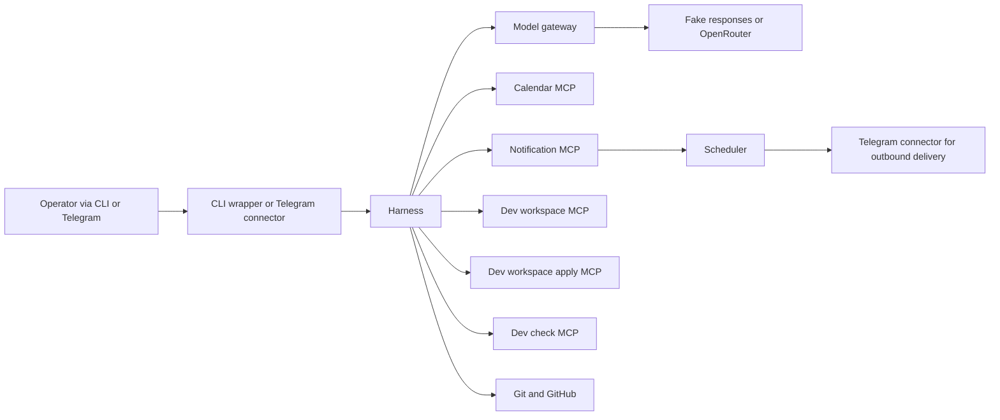
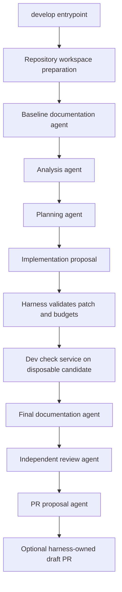

# Architecture

> Generated with `ai-craftkit` skill: `archdoc`  
> Source: `git@github-safeplane:stefanrossmeier/safeplane.git` at commit `f037db0a92226a56fb047cf2bfd43871e4dd0bd2`  
> Prompt: `Provide the documents for this repo`

Last Reviewed Scope: full review
Doc Status: DRAFT
Last Architecture Update: 2026-07-23T18:38:28Z
Updated By: agent
Source Basis: README scan; existing docs; code scan; deployment files; test scripts

## Purpose

This document describes the static architecture of Safeplane: core modules, boundaries, dependencies, ownership, and deliberate constraints. Detailed command, endpoint, and tool contracts live in `API_SURFACE.md`. Runtime startup, operations, and recovery live in `OPERATIONS.md`.

## Architecture Summary

Safeplane is a bounded orchestration system built around a single authority service. Connectors are intentionally thin. The harness owns session and run lifecycle, workflow selection, model invocation, MCP authorization, developer pipeline sequencing, patch approval, controlled checks, evidence, Git operations, and draft PR publication. The model gateway isolates provider credentials and translates workflow model profiles into fake or real responses. MCP servers implement tool behavior behind narrow data or workspace boundaries.

## Main Components

| Component | Ownership | Static responsibility | Key dependencies |
| --- | --- | --- | --- |
| `harness` | core authority service | workflow registry, run/session state, agent runtime, developer pipeline, MCP broker, patch approval, remote write, evidence | `safeplane.yaml`, workflow YAML, model-gateway, MCP services |
| `model-gateway` | model isolation service | model profile resolution, fake or real completion, provider secret boundary, model trace logging | workflow contracts, prompt files, OpenRouter in real mode |
| `calendar-task-mcp` | tool service | calendar list/create/cancel under `data/calendar` boundary | harness schemas and calendar store |
| `notification-task-mcp` | tool service | notification schedule/list/cancel under `data/notifications` boundary | scheduler `/reload`, notification store |
| `scheduler` | delivery service | persisted schedule reconciliation and notification delivery orchestration | notification data, optional Telegram connector |
| `telegram-connector` | connector | Telegram command translation, allowlist enforcement, chat-to-session mapping, outbound notification delivery endpoint | harness API, Telegram API |
| `dev-workspace-mcp` family | developer tooling boundary | repo listing, search, reads, Git metadata, patch proposal, patch apply, declared checks | per-run workspace snapshot, harness schemas |
| `workflows/` and `prompts/` | contract layer | versioned workflow behavior, model profiles, tool allowlists, prompt versions | harness and model-gateway loaders |

## Layering And Boundaries

### Interface layer

- CLI wrappers in `scripts/` and the Telegram connector accept operator input.
- These entry points do not own policy or workflow sequencing.

### Orchestration layer

- The harness is the only service that understands entrypoints, sessions, runs, MCP permissions, developer stages, approvals, and publication policy.
- Repository-changing authority remains here even when developer tooling is enabled.

### Capability layer

- The model gateway owns provider access.
- MCP services own narrow tool behavior and storage-local invariants.
- The scheduler owns time-based notification execution.

### Data and state layer

- Runtime state is persisted under `SAFEPLANE_HOME`.
- Secrets are mounted from `SAFEPLANE_SECRET_ROOT` and are intentionally not part of runtime state.

## Static Module Map

| Module path | Responsibility |
| --- | --- |
| `services/harness/src/harness/main.py` | FastAPI ingress for runs, connectors, MCP broker, patch approval, and remote approval |
| `services/harness/src/harness/agent_runtime.py` | generic workflow execution path for chat and assistant-style runs |
| `services/harness/src/harness/workflow_registry.py` | registry build and workflow exposure rules |
| `services/harness/src/harness/developer_pipeline.py` | fixed developer stage machine and artifact handling |
| `services/harness/src/harness/repository_workspace.py` | isolated target repo and external skill checkout preparation |
| `services/harness/src/harness/patch_approval_store.py` | approval record and staging workspace management |
| `services/harness/src/harness/remote_write.py` | deterministic branch push and draft PR creation |
| `services/harness/src/harness/mcp_broker.py` | tool permission checks and MCP HTTP mediation |
| `services/harness/src/harness/mcp_schemas.py` | calendar plus extension tool schema validation |
| `services/harness/src/harness/dev_workspace_schemas.py` | developer MCP schemas and patch budget contracts |
| `services/model-gateway/src/model_gateway/main.py` | workflow model profile loader and completion API |
| `services/scheduler/src/safeplane_scheduler/main.py` | notification scheduler runtime and control API |

## Dependency Shape

| From | Depends on | Why |
| --- | --- | --- |
| connectors | harness | all operator-visible workflows go through the harness |
| harness | workflow contracts and prompt paths | registry build and runtime configuration |
| harness | model-gateway `/chat` | model invocation |
| harness | MCP services `/mcp` or `/mcp/tools/call` | tool execution under policy |
| notification-task-mcp | scheduler `/reload` | sync scheduled state after create or cancel |
| scheduler | Telegram connector | optional outbound delivery path |
| developer workflow | dev-workspace, apply, check services | read-only inspection, controlled apply, isolated checks |
| remote write path | Git, GitHub or GitHub mock | draft PR publication only |

The dependency graph is intentionally asymmetric: connectors and MCP services depend on the harness contract, but the harness does not delegate authority back to them.

## Data Ownership

| Data | Owner | Stored under | Notes |
| --- | --- | --- | --- |
| session records | harness | `SAFEPLANE_HOME/sessions` | authoritative conversational session state |
| run records | harness | `SAFEPLANE_HOME/runs` | status, workflow, pipeline state |
| traces | harness and model-gateway | `SAFEPLANE_HOME/traces` | per-turn evidence |
| developer workspaces | harness | `SAFEPLANE_HOME/workspaces/<run-id>` | repo snapshots, pipeline artifacts, approval data |
| calendar store | calendar tool path | `SAFEPLANE_HOME/data/calendar` | shared by assistant tools and calendar CLI |
| notification store | notification tool and scheduler path | `SAFEPLANE_HOME/data/notifications` | schedules, outbox, delivery state |
| connector session map | telegram connector | `SAFEPLANE_HOME/connectors/telegram/sessions.json` | convenience mapping only; harness still owns authoritative sessions |
| secrets | specific service only | `SAFEPLANE_SECRET_ROOT` mounted to `/run/secrets/...` | never part of runtime root |

## Interface Ownership Summary

Detailed interface contracts are documented in `API_SURFACE.md`. At a high level:

- `scripts/` own the operator CLI shell experience.
- `services/harness/src/harness/main.py` owns the internal HTTP control surface.
- `services/model-gateway/src/model_gateway/main.py` owns the model mediation HTTP API.
- `services/scheduler/src/safeplane_scheduler/main.py` owns scheduler control endpoints.
- MCP servers own JSON-RPC tool implementations.
- `safeplane.yaml` and `workflows/*.yaml` own exposed entrypoint and workflow contracts.

## Developer Workflow Architecture

The developer path is the most structurally distinct subsystem.

Static implications:

- only the harness chooses stage order;
- documentation is part of the contract, both before and after implementation;
- implementation produces a proposal, not an authoritative write;
- apply and check services are separate boundaries, even though they share the dev-workspace image.

## Security And Trust Boundaries

| Boundary | Repository evidence | Architectural effect |
| --- | --- | --- |
| secret root outside runtime root | `docs/security/secrets.md`, Compose secret mounts | runtime cleanup or evidence collection should not touch credentials |
| read-only root filesystems and dropped capabilities | Compose files, `docs/security/runtime-boundaries.md` | services are intentionally constrained |
| internal networks for service-to-service traffic | `docker-compose.yml` and overlays | internal APIs are not designed as public endpoints |
| harness-only GitHub secret | `docker-compose.github.yml`, `docs/remote-write.md` | agents and tool services cannot publish directly |
| model-gateway-only OpenRouter secret | `docker-compose.real.yml`, `services/model-gateway/src/model_gateway/main.py` | harness cannot leak provider secrets through generic tool paths |
| dev-check `network_mode: none` | `docker-compose.developer.yml` | declared checks run without network egress |

## Architectural Decisions And Constraints

Verified recurring constraints from code and docs:

- connectors are dumb transport adapters;
- the harness owns session lifecycle, stage order, and authoritative writes;
- workflow and prompt files are versioned contracts;
- model access is isolated behind `model-gateway`;
- remote publication is draft-PR only and never merge;
- fake mode is the default validation path;
- developer workflow is single-pass and does not auto-loop after `REQUEST_CHANGES`.

## Testing And Confidence

| Claim | Evidence | Status |
| --- | --- | --- |
| Safeplane centers authority in the harness | `services/harness/src/harness/main.py`, `docs/repo-layout.md`, `docs/mcp.md` | verified |
| Tool services are separate narrow boundaries | `mcp-servers/*/main.py`, `docs/security/runtime-boundaries.md` | verified |
| Developer runs use isolated read-only workspaces and separate apply/check boundaries | `docker-compose.developer.yml`, `services/harness/src/harness/dev_workspace_schemas.py`, `docs/repository-workspaces.md` | verified |
| Draft PR publication is idempotent and harness-owned | `docs/remote-write.md`, `tests/scripts/accept-draft-pr-workflow` | verified |
| Safeplane is actively deployed on MacBook and VPS environments, while recovery and packaging hardening remain ongoing | `README.md`, `docs/vps-operations.md`, `docs/runtime-artifacts.md` | verified |

## High-Risk Change Areas

| Area | What can break | Why it is structurally risky |
| --- | --- | --- |
| workflow registry and `safeplane.yaml` | entrypoint exposure, wrong default workflow, broken connector commands | many interfaces derive from these contracts |
| developer pipeline plus dev-workspace schemas | unauthorized write expansion, broken plan budgets, invalid check behavior | central safety boundary for repo-changing runs |
| remote write path | accidental push or wrong repository binding | mixes workspace, Git, GitHub, and approval constraints |
| notification bridge to scheduler | stale schedules or missing delivery after tool actions | state crosses MCP and scheduler boundaries |
| calendar and notification schema changes | tool retries and validation failures | harness and services both depend on strict Pydantic contracts |

## Known Structural Weaknesses

- The harness centralizes a large amount of responsibility. That is intentional, but it means small harness changes can affect routing, sessions, tools, developer workflows, and publication at once.
- Several runtime invariants are documented across multiple docs plus Compose overlays; changes need synchronized updates to contracts, scripts, and docs.
- The repo contains multiple runtime modes and overlays. Interface safety often depends on the exact Compose combination, not just the code module.

## Known Unknowns

- I did not inspect every ADR file, so this document reflects current architecture from code and active docs rather than a full historical design review.
- I did not verify whether additional MCP servers beyond the visible Compose overlays are planned but currently inactive.