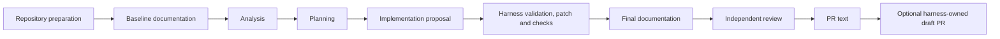

# Developer workflow and artifact flow

The developer workflow is a fixed, versioned, single-pass contract. The harness
prepares repositories, executes each stage in order, validates every artifact,
and stops on failed checks, `REQUEST_CHANGES`, plan deviation, or an invalid
remote-write binding. Agents cannot choose the next stage.



Contract: `workflows/developer/workflow.yaml`

Prompt manifest: `prompts/developer/manifest.yaml`

## Agent contracts

| Stage / agent | Reads | Produces |
| --- | --- | --- |
| Baseline documentation / `documentation` | repository context; complete target repository evidence; existing target documentation; external `archdoc` source at its resolved commit; no actionable operator task | validated documentation replacements or no-change result; `DocumentationResult`; baseline target documentation consumed by later agents |
| Analysis / `analysis` | `developer_request`, `repository_context`, `baseline_documentation` | `AnalysisResult`: requirements, architecture impact, granular tasks, assumptions, and risks |
| Planning / `planning` | `developer_request`, `repository_context`, `baseline_documentation`, `analysis` | `ImplementationPlan`: exact file plan, expected change mechanism per file, operation and line budgets, isolated check commands, documentation impact, and proposed commit message |
| Implementation / `implementation` | approved request, repository context and evidence, baseline documentation, analysis, implementation plan, and deterministic repair feedback when validation rejects a candidate | `ImplementationPatch`: exact old/new replacements and implementation summary within the approved plan |
| Final documentation / `documentation` | final changed repository, implementation artifacts, check evidence, and the same resolved `archdoc` commit | validated final documentation replacements or a validated no-change result; final `DocumentationResult` |
| Review / `review` | request, repository context, baseline documentation, analysis, plan, implementation proposal, authoritative apply result, checks, and final documentation result | `ReviewResult`: `LGTM` or `REQUEST_CHANGES`; `ALIGNED` or `DEVIATION`; findings, requested changes, summary, and residual risks |
| PR / `pr` | validated request, analysis, plan, implementation and apply artifacts, checks, final documentation, and review result | `PrProposal`: title and body with checks, risks, documentation, and human-review summary |

## Prompt contracts

| Agent | Prompt contract |
| --- | --- |
| `documentation` | `developer.documentation.system@v3` |
| `analysis` | `developer.analysis.system@v1` |
| `planning` | `developer.planning.system@v7` |
| `implementation` | `developer.implementation.system@v7` |
| `review` | `developer.review.system@v2` |
| `pr` | `developer.pr.system@v1` |

The baseline and final documentation stages use the same documentation agent
and prompt contract. The resolved external `archdoc` source is restricted to
that agent and is not copied into Safeplane's prompt bundle.

## Proposal versus authoritative action

| Agent-authored proposal | Harness-owned authoritative action |
| --- | --- |
| documentation replacements | validate scope and exact old text; generate and apply the documentation patch |
| requirements, architecture impact, tasks, assumptions and risks | persist validated analysis artifacts and pass only declared inputs forward |
| exact file plan, budgets and check plan | normalize and validate allowed paths, operations, budgets and command profiles |
| exact old/new implementation replacements | validate plan compliance and applicability; generate the authoritative Git patch |
| zero or more requested declared checks | run declared commands without a shell in a disposable candidate copy with no network or inherited secrets; preserve explicit no-check plans |
| review verdict and plan alignment | stop on failed checks, `REQUEST_CHANGES`, or `DEVIATION`; determine approval eligibility |
| PR title and body | bind the immutable result; optionally push a non-force branch and create or reuse one draft PR |

The implementation model never applies its own patch. Before authoritative
application, the harness builds a candidate patch, checks exact plan and budget
compliance, and runs any declared checks against a disposable candidate. A plan may
explicitly declare no repository checks when none is relevant and grounded in
repository evidence; deterministic scope, patch, and review validation still
apply. Only an accepted candidate crosses the controlled write boundary. Any
declared checks run again against the applied workspace and become review
evidence.

## Persisted artifacts

The pipeline writes validated artifacts under the run workspace, including:

```text
request.json
repository-context.json
baseline_documentation.json
analysis.json
requirements.md
tasks.md
planning.json
plan.md
check-plan.json
implementation.json
implementation.patch
implementation-summary.md
implementation-apply.json
checks.json
final_documentation.json
review.json
review.md
pr.json
pr.md
```

Repository preparation, documentation evidence, patch proposals, candidate
checks, remote-approval requests, Git results, and publication evidence add
further files when applicable. `./scripts/safeplane status <run-id>` exposes the
current state; `./scripts/safeplane evidence <run-id>` collects the available
run evidence.

## Publication boundary

A repository profile with `draft_pr_creation: automatic` authorizes the harness
to create a draft PR only after immutable repository, workspace, patch, check,
review, and plan-alignment bindings pass. An `approval_required` profile needs
explicit operator approval through:

```bash
./scripts/safeplane approve-pr <run-id>
```

Approval is idempotent. Pushes are non-force. Agents receive no GitHub
credential. Safeplane never merges.
