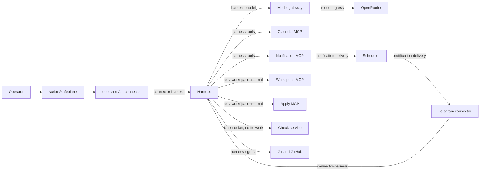

# Container interactions and runtime boundaries

Safeplane separates runtime state from credentials and gives each service only
the data, networks, and secrets required by its capability.

```text
SAFEPLANE_HOME        runtime state, configuration, logs, and workspaces
SAFEPLANE_SECRET_ROOT credentials mounted as named Docker secrets
```

Defaults:

```text
SAFEPLANE_HOME=$HOME/.safeplane
SAFEPLANE_SECRET_ROOT=$HOME/.config/safeplane/secrets
```

`SAFEPLANE_SECRET_ROOT` must remain outside `SAFEPLANE_HOME`.



## Service matrix

`rw` means writable; `ro` means read-only. Paths are relative to
`SAFEPLANE_HOME` unless shown as repository files or named volumes.

| Service | Calls or receives calls | Networks | Writable mounts | Read-only mounts | Secret mounts | External egress | Host ports |
| --- | --- | --- | --- | --- | --- | --- | --- |
| `harness` | receives CLI/Telegram requests; calls model gateway, MCP services, Git, and GitHub | `harness-egress`, `harness-model`, `harness-tools`, `connector-harness`; optional `dev-workspace-internal`, `github-mock-internal` | `sessions`, `runs`, `traces`, `workspaces`, `logs/mcp`; test-only `publication-remotes` volume | `config`, `safeplane.yaml`, `workflows`, `prompts`; optional developer source and local Git fixtures | `github_token` only in GitHub mode | Git and GitHub | `127.0.0.1:8787` only with local overlay; `127.0.0.1:18787` in test overlay |
| `cli-connector` | receives one operator command; calls harness | `connector-harness` | none | none | none | none | none |
| `model-gateway` | receives model requests from harness; calls provider in real mode | `harness-model`, `model-egress` | `traces` | `workflows`, `prompts` | `openrouter_api_key` only in real mode | OpenRouter in real mode | none |
| `calendar-task-mcp` | receives harness-brokered calendar calls | `harness-tools` | `data/calendar`, `logs/mcp` | none | none | none | none |
| `notification-task-mcp` | receives harness-brokered notification calls; requests scheduler reload/delivery work | `harness-tools`, `notification-delivery` | `data/notifications`, `logs/mcp` | none | none | none | none |
| `scheduler` | receives notification work; calls Telegram connector when enabled | `notification-delivery` | `data/notifications`, `logs/scheduler` | `data/calendar` | none | none | none |
| `telegram-connector` | polls Telegram; calls harness; receives outbound notification requests | `telegram-egress`, `connector-harness`, `notification-delivery` | `connectors/telegram`, `logs/connectors/telegram` | none | `telegram_bot_token`, `telegram_allowed_user_ids` | Telegram API | none |
| `dev-workspace-mcp` | receives read-only repository inspection calls from harness | `dev-workspace-internal` | none | per-run `workspaces` | none | none | none |
| `dev-workspace-apply-mcp` | receives one-time controlled apply calls from harness | `dev-workspace-internal` | per-run `workspaces` | none | none | none | none |
| `dev-check-mcp` | receives declared check jobs over a Unix socket | `network_mode: none` | control socket volume; disposable tmpfs candidate | per-run `workspaces` | none | none | none |
| `github-mock` | test-only GitHub API fixture called by harness | `github-mock-internal` | `mock-github` | none | none | none | none |

## Why the harness is the authority boundary

Agents produce validated proposals; they do not receive credentials or direct
access to authoritative writes. The harness selects the next fixed workflow
stage, authorizes MCP calls, validates schemas and budgets, generates patches,
runs checks, applies accepted changes, performs Git operations, and records
evidence. MCP services enforce narrow data boundaries but do not decide policy.

This separation prevents a model or tool service from granting itself a new
permission, reading an unrelated credential, bypassing failed checks, or
publishing an unbound workspace.

## Process and secret policy

Long-running services use UID/GID `10001:10001`, read-only root filesystems,
`no-new-privileges`, dropped Linux capabilities, bounded tmpfs, CPU, memory and
PID limits, health checks, and health-conditioned dependencies where required.
The one-shot CLI connector uses the same process hardening but has `restart: no`
and no health check because it is not a daemon.

The secret directory is mode `0700`. Secret files are mode `0644` inside that
private directory so the fixed non-root container UID can read only the single
file mounted through Compose as a named secret. Secret values are not passed as
environment variables or build arguments.

## Verification

Static policy and strict Compose parsing:

```bash
tests/scripts/test-unit -q
tests/scripts/accept-repository-cleanup
```

Rendered and running-container boundaries:

```bash
tests/scripts/accept-runtime-hardening
tests/scripts/accept-cli-connector
```

Runtime mode and health inspection:

```bash
tests/scripts/status-safeplane-mode
```
